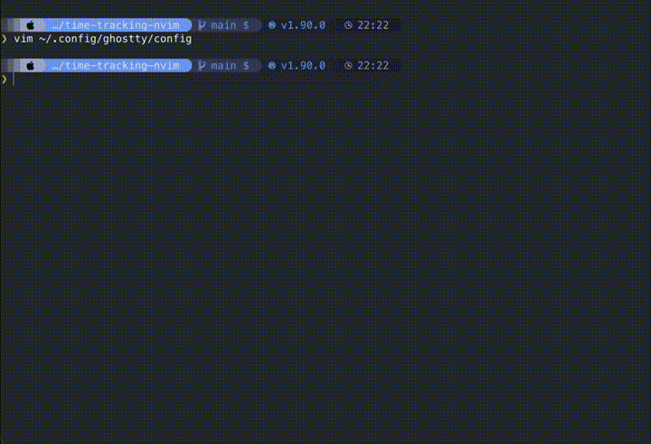

# Time Tracking Neovim Plugin

A high-performance Neovim plugin written in Rust that provides live time tracking previews while editing markdown files. Built with [nvim-oxi](https://github.com/noib3/nvim-oxi) for optimal performance and reliability.



## Features

- 🚀 **High Performance**: Written in Rust for minimal overhead
- 📊 **Live Preview**: Real-time updates as you edit your time tracking files  
- 🪟 **Smart Window Management**: Automatic opening/closing of preview windows
- 📁 **Directory Aware**: Only activates for files in your configured time tracking directory
- ⌨️ **Keyboard Shortcuts**: Easy toggle commands and keybindings
- 🔧 **Zero Configuration**: Works out of the box with sensible defaults

## Installation

### Using [lazy.nvim](https://github.com/folke/lazy.nvim) (Recommended)

```lua
{
  "stevenwcarter/time-tracking-nvim",
  config = function()
    require("time-tracking-nvim").setup()
  end,
}
```

### Using [packer.nvim](https://github.com/wbthomason/packer.nvim)

```lua
use {
  "stevenwcarter/time-tracking-nvim",
  config = function()
    require("time-tracking-nvim").setup()
  end,
}
```

### Using [vim-plug](https://github.com/junegunn/vim-plug)

```vim
Plug 'stevenwcarter/time-tracking-nvim'

lua << EOF
require("time-tracking-nvim").setup()
EOF
```

## Configuration

The plugin itself works with zero configuration, but does utilize the configuration for
the [time-tracking-cli utility](https://github.com/stevenwcarter/time-tracking-cli)

### Setup options

```lua
require("time-tracking-nvim").setup({
  auto_download = true,              -- download the native binary if it is missing
  auto_update = true,                -- re-download when the plugin version changes
  allow_unverified_download = false, -- install a binary that has no published digest
})
```

- `auto_download` (default `true`) — fetch the release archive for your platform
  when the native binary is not present.
- `auto_update` (default `true`) — re-download when the installed binary's version
  no longer matches the plugin's.
- `allow_unverified_download` (default `false`) — downloads are verified against
  the `SHA256SUMS` asset published with each release, and the archive is only
  extracted if its digest matches. Verification is fail-closed: if a release has
  no `SHA256SUMS`, or the digest does not match, the download is refused rather
  than installed.

  **`SHA256SUMS` is published from v0.2.0 onward; releases up to and including
  v0.1.7 predate it.** The plugin always downloads the release matching its own
  version, so on v0.2.0 or later this is transparent. If you pin an older tag,
  that release has no checksums and the download refuses with
  `No SHA256SUMS published for this release` — setting this option to `true`
  installs anyway.

  Leave it `false` otherwise — a downloaded native library is loaded with
  `require`, which executes its code inside your editor.
  Note that this option only ever waives a *missing* `SHA256SUMS`: a digest
  **mismatch** is always refused, no matter how this is set.


## Usage

### Commands

The plugin provides several commands:

- `:TimeTrackingToggle` - Toggle the preview window on/off
- `:TimeTrackingUpdate` - Manually update the preview content
- `:TimeTrackingClose` - Close the preview window

### Default Keybindings

- `<leader>tt` - Toggle time tracking preview

### Automatic Behavior

The plugin automatically:

1. **Opens preview** when you enter a markdown file in your time tracking directory
2. **Updates preview** in real-time as you type
3. **Closes preview** when you leave time tracking files or quit Neovim
4. **Manages window layout** to keep preview at 1/3 screen width

## How It Works

This plugin integrates with [time-tracking-cli](https://github.com/stevenwcarter/time-tracking-cli) to:

1. **Detect time tracking files** based on your configured data directory
2. **Parse markdown content** to extract time tracking information
3. **Format and display** summaries in a live preview window
4. **Update automatically** as you edit your time tracking files

## Requirements

- Neovim 0.11+ 
- The plugin includes pre-compiled binaries for:
  - Linux x86_64
  - macOS (Intel and Apple Silicon)
  - Windows x86_64

## Troubleshooting

Start here:

```vim
:checkhealth time-tracking-nvim
```

It reports the detected platform, whether the native library is present and
loadable, whether the plugin and binary versions agree, whether
`package.cpath` is set up, whether the commands registered, and whether
`curl`/`tar`/`unzip` are available for auto-download.

For startup problems that happen before the plugin loads, capture the debug
log:

```bash
TIME_TRACKING_DEBUG=1 nvim 2>/tmp/ttnvim.log
```

### Preview Not Showing

Run `:TimeTrackingToggle` — it now reports why when the current buffer is
not a tracking file, naming both the buffer and the configured data
directory. The preview only opens for `.md` files inside your
time-tracking-cli `data_directory`.

### Version Information

```vim
:lua require('time-tracking-nvim').version_info()
```

### Performance Issues

The plugin is designed to be lightweight, but if you experience issues:

1. The preview updates on every text change - this is normal
2. Large files might cause slower updates
3. Report performance issues on GitHub

## Development

### Building from Source

```bash
git clone https://github.com/stevenwcarter/time-tracking-nvim
cd time-tracking-nvim
cargo build --release
```

### Contributing

1. Fork the repository
2. Create a feature branch
3. Make your changes
4. Add tests if applicable
5. Submit a pull request

## License

This project is licensed under the MIT License - see the LICENSE file for details.

## Related Projects

- [time-tracking-cli](https://github.com/stevenwcarter/time-tracking-cli) - The core time tracking functionality
- [time-tracking-parser](https://github.com/stevenwcarter/time-tracking-parser) - The parser for the time tracking format
- [nvim-oxi](https://github.com/noib3/nvim-oxi) - Rust bindings for Neovim plugins
